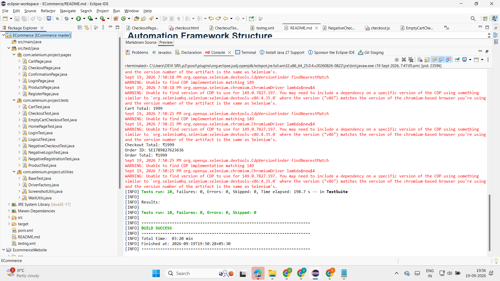

# ShopEasy E-Commerce Selenium Automation Framework

## Project Overview

ShopEasy is a sample e-commerce web application created to demonstrate end-to-end web application testing using Selenium WebDriver with Java and TestNG.

The automation framework validates key e-commerce workflows including user registration, login, product search, cart operations, checkout, order confirmation, and logout.

The project follows the Page Object Model (POM) design pattern with reusable utilities for driver management, explicit waits, and failure screenshots.

## Technologies Used

- Java
- Selenium WebDriver 4.35.0
- TestNG 7.11.0
- Maven
- Chrome
- Git
- GitHub
- Page Object Model (POM)

## Application Features Tested

The ShopEasy application contains the following features:

1. Home page
2. User registration
3. User login
4. Product listing
5. Product search
6. Add product to cart
7. Increase product quantity
8. Decrease product quantity
9. Remove product from cart
10. Checkout
11. Payment method selection
12. Order confirmation
13. User logout

## Automation Framework Structure

```text
Ecommerce
|
├── src
│   └── test
│       └── java
│           └── com.selenium.project
│
│               ├── pages
│               │   ├── LoginPage.java
│               │   ├── RegisterPage.java
│               │   ├── ProductsPage.java
│               │   ├── CartPage.java
│               │   ├── CheckoutPage.java
│               │   └── ConfirmationPage.java
│               │
│               ├── tests
│               │   ├── HomePageTest.java
│               │   ├── LoginTest.java
│               │   ├── NegativeLoginTest.java
│               │   ├── NegativeRegistrationTest.java
│               │   ├── NegativeCheckoutTest.java
│               │   ├── EmptyCartCheckoutTest.java
│               │   ├── ProductTest.java
│               │   ├── CartTest.java
│               │   ├── CheckoutTest.java
│               │   └── LogoutTest.java
│               │
│               └── utilities
│                   ├── DriverFactory.java
│                   ├── BaseTest.java
│                   ├── WaitUtils.java
│                   └── ScreenshotUtils.java
│
├── pom.xml
├── testng.xml
└── README.md
## Test Execution Result

The complete automation suite currently executes successfully.

```text
Tests run: 10
Failures: 0
Errors: 0
Skipped: 0

BUILD SUCCESS
```

### Test Execution Screenshot

